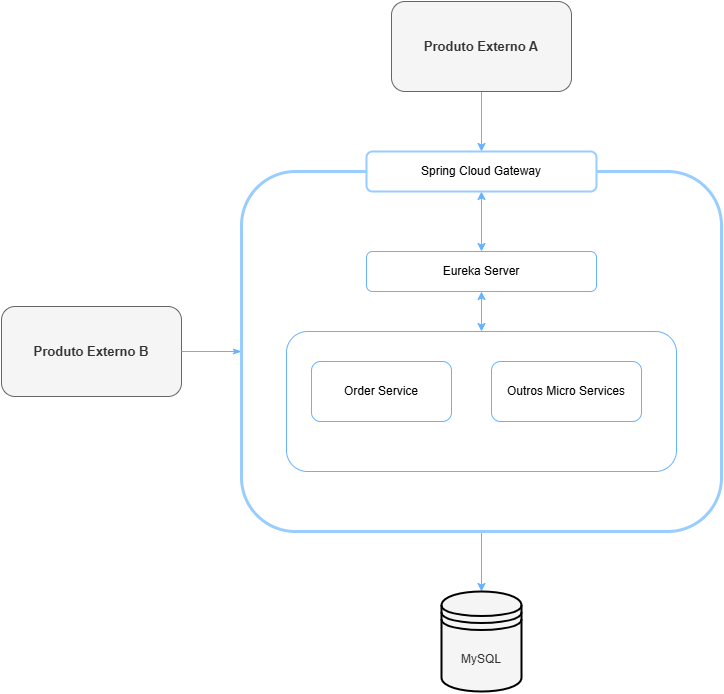

# Order Managment

Solução proposta para o teste técnico: Implantação do gerenciamento de pedidos

## 🚀 Começando

Foi criado em formato de microservices, e para garantir a disponibilidade e consistência do servicos, pode ser iniciado várias instâncias do orderservice.

* Eureka Server: Com o eureka server, é possivel registar várias instâncias do mesmo serviço, garantindo a disponibilidade e balanceamento de carga;
* Spring Cloud Gateway: Com o Gateway do Spring Cloud é possível realizar requisições para o orderservice utilizando a mesma url, deixando então o eureka realizar o balanceamento da carga através das várias instâncias.

### 📋 Pré-requisitos

* Java JDK 21
* Spring 3.4.x

### 🔧 Execução

Deve-se iniciar primeiro o Eureka Servier, depois disso pode-se inicar os demais em qualquer ordem.

* Para auxiliar nos testes, há uma collection para o postman: Service.postman_collection.json

### 🔧 Proposta
Como evolução, criação de mais services para gerenciamento passo a passo dos pedidos, como cálculo envio e aplicar filas de mensageria com kafka.
Também implementação de Segurança com Spring Security e OAuth2

## 🛠️ Construído com

Tecnologias usadas no projeto:

* [Spring Cloud](https://spring.io/projects/spring-cloud) - O framework web usado
* [Eureka Server](https://spring.io/projects/spring-cloud) - Gerenciamento de Microservices e balanceamento de carga
* [ROME](https://rometools.github.io/rome/) - Usada para gerar RSS
* [Reactive](https://spring.io/reactive) - Gerenciamento Gateway
* [Spring Data JPA](https://spring.io/projects/spring-data-jpa) - Persistência de Dados
* [Flyway](https://documentation.red-gate.com/fd/redgate-flyway-documentation-138346877.html) - Versiosamento do Banco de Dados
* [MySQL 8.0](https://www.mysql.com/) - Banco de Dados MySQL 8.0